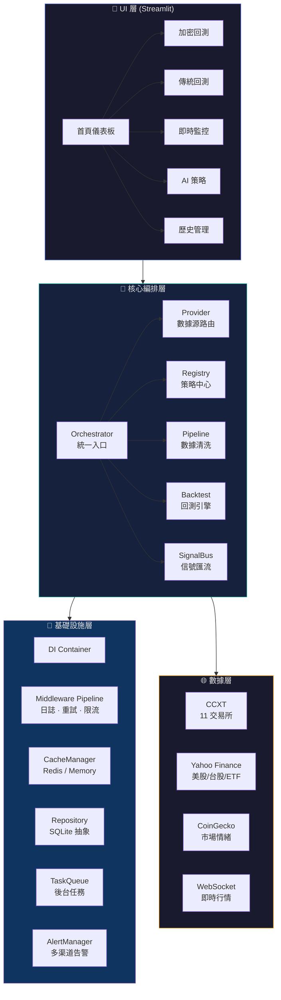
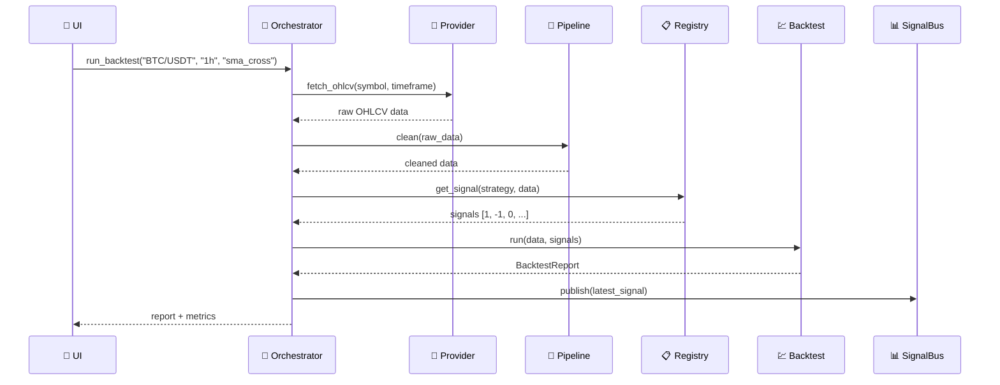

<div align="center">


# 📊 StocksX

### 機構級量化回測與即時交易監控平台

[](https://www.python.org/)
[](https://streamlit.io)
[](https://fastapi.tiangolo.com/)
[](https://www.docker.com/)
[](https://github.com/iiooiioo888/StocksX_V0/actions)
[](LICENSE)
[](https://docs.astral.sh/ruff/)
[](https://docs.pytest.org/)

**跨市場回測 · 15+ 專業策略 · 即時監控 · WebSocket 推送 · AI 情緒分析**

[快速開始](#-快速開始) · [功能亮點](#-功能亮點) · [架構設計](#-架構設計) · [部署指南](#-部署指南)

</div>

---

## ⚡ 一鍵啟動

```bash
git clone https://github.com/iiooiioo888/StocksX_V0.git && cd StocksX_V0
cp .env.example .env && docker compose up -d
# 👉 http://localhost:8501
```

---

## ✨ 功能亮點

<table>
<tr>
<td width="50%">

### 🔍 多市場回測
- 11 個交易所 · 美股/台股/ETF/期貨
- 真實手續費模擬 · Walk-Forward 分析
- 多策略對比 · 參數網格搜索

### ⚡ 即時監控
- WebSocket 幣安推送 · 策略訂閱
- 自動交易 · 即時 P&L 追蹤
- 連接斷線自動重試

</td>
<td width="50%">

### 🤖 AI 增強
- FinBERT 情緒分析 · LSTM 預測
- 恐懼貪婪指數 · VIX 波動率
- DashScope / OpenAI 整合

### 🏗️ 現代架構
- Orchestrator 編排 · DI 容器
- 中間件管道 · Repository 模式
- 結構化日誌 · Prometheus 監控

</td>
</tr>
</table>

### 📊 策略庫（15+ 策略）

| 類別 | 策略 | 說明 |
|:---:|------|------|
| 📈 趨勢 | 雙均線交叉 · EMA 交叉 · MACD · ADX · 超級趨勢 · 拋物線 SAR | 趨勢跟隨與動量 |
| 🔀 擺盪 | RSI · KD · 威廉指標 · 布林帶 · 一目均衡表 | 超買超賣振盪 |
| 💥 突破 | 唐奇安通道 · 雙推力 · VWAP 回歸 | 區間突破與均值回歸 |
| 🧠 AI/ML | LSTM 預測 · 情緒分析 · 多因子策略 · 配對交易 | 機器學習增強 |

---

## 🏗️ 架構設計

### 系統架構圖



### 數據流



### 技術棧

| 層級 | 技術 | 用途 |
|:---:|------|------|
| **前端** | Streamlit · Plotly · Glassmorphism CSS | 互動式 Web UI |
| **後端** | Python 3.10+ · FastAPI · Uvicorn | API 服務 & WebSocket |
| **即時** | WebSocket · CCXT · Binance API | 即時行情推送 |
| **數據** | Pandas · NumPy · yfinance · CoinGecko | 數據處理與來源 |
| **AI/ML** | scikit-learn · DashScope · FinBERT | 機器學習 & 情緒分析 |
| **存儲** | SQLite · Redis · SQLAlchemy | 數據持久化 & 快取 |
| **任務** | Celery · ThreadPool | 後台異步任務 |
| **監控** | Prometheus · Grafana · psutil | 系統監控告警 |
| **DevOps** | Docker · Docker Compose · GitHub Actions | CI/CD & 部署 |
| **品質** | Ruff · pytest · bandit · mypy | 代碼品質保障 |

---

## 🚀 快速開始

### 方式一：Docker（推薦）

```bash
# 1. 克隆專案
git clone https://github.com/iiooiioo888/StocksX_V0.git
cd StocksX_V0

# 2. 配置環境
cp .env.example .env
# 編輯 .env，至少設定：
#   SECRET_KEY=<隨機字串>     # python -c "import secrets; print(secrets.token_hex(32))"
#   ADMIN_PASSWORD=<你的密碼>

# 3. 啟動服務
docker compose up -d

# 4. 訪問
# 主應用：http://localhost:8501
# WebSocket：ws://localhost:8001/ws
```

### 方式二：本地開發

```bash
# 1. 建立虛擬環境
python -m venv .venv && source .venv/bin/activate

# 2. 安裝依賴
pip install -r requirements.txt -r requirements-dev.txt

# 3. 配置環境
cp .env.example .env

# 4. 啟動
streamlit run app.py
```

### 方式三：含監控部署

```bash
docker compose --profile monitoring up -d
# Grafana：http://localhost:3000
# Prometheus：http://localhost:9090
```

---

## 📁 專案結構

```
StocksX_V0/
├── app.py                              # 🏠 主頁儀表板
├── pages/                              # 📱 Streamlit 多頁應用
│   ├── 1_🔐_登入.py                    #   用戶認證
│   ├── 2_₿_加密回測.py                #   加密貨幣回測
│   ├── 2_🏛️_傳統回測.py               #   美股/台股/ETF
│   ├── 3_📜_歷史.py                    #   歷史記錄 & 對比
│   ├── 4_🛠️_管理.py                   #   管理後台
│   ├── 5_📡_交易監控.py                #   策略訂閱監控
│   ├── 6_📰_新聞.py                    #   RSS 新聞聚合
│   ├── 7_🏥_健康檢查.py                #   系統健康監控
│   ├── 8_⚡_即時監控.py                #   WebSocket 即時
│   ├── 9_🧠_AI 策略.py                 #   AI 情緒分析
│   ├── 10_📊_策略回测对比.py            #   多策略對比
│   └── 11_🤖_自動交易.py               #   自動交易配置
├── src/
│   ├── core/                           # 🏗️ 核心架構
│   │   ├── orchestrator.py             #   統一編排層
│   │   ├── middleware.py               #   中間件管道
│   │   ├── cache_manager.py            #   快取管理
│   │   ├── repository.py               #   Repository Pattern
│   │   ├── tasks.py                    #   後台任務隊列
│   │   ├── alerts.py                   #   告警系統
│   │   ├── container.py                #   DI 容器
│   │   ├── config.py                   #   配置管理
│   │   ├── provider.py                 #   數據源抽象
│   │   ├── pipeline.py                 #   數據清洗管道
│   │   ├── signals.py                  #   信號系統
│   │   ├── registry.py                 #   策略註冊中心
│   │   ├── backtest.py                 #   回測引擎
│   │   └── adapters.py                 #   Provider 實現
│   ├── auth/                           # 🔐 用戶認證
│   ├── backtest/                       # 💹 回測引擎 & 策略庫
│   ├── data/                           # 📡 數據源整合
│   ├── strategies/                     # 🧠 進階策略（ML/NLP/RL）
│   ├── trading/                        # 🤖 自動交易引擎
│   ├── utils/                          # 🔧 工具
│   └── ui_*.py                         # 🎨 UI 組件
├── tests/                              # 🧪 pytest 測試
│   └── test_core/                      #   核心模組測試
├── .github/workflows/ci.yml            # 🔄 CI/CD
├── docker-compose.yml                  # 🐳 Docker 編排
├── Dockerfile                          # 🐳 多階段構建
├── Makefile                            # 🔨 開發命令
└── pyproject.toml                      # ⚙️ Ruff 配置
```

---

## ⚙️ 配置

### 環境變數 (.env)

| 變數 | 說明 | 預設值 | 必填 |
|------|------|--------|:---:|
| `SECRET_KEY` | JWT 簽名密鑰 | — | ✅ |
| `ADMIN_PASSWORD` | 管理員密碼 | 自動生成 | ✅ |
| `DATABASE_URL` | 資料庫連接 | `sqlite:///data/stocksx.db` | |
| `REDIS_URL` | Redis 連接 | `redis://localhost:6379/0` | |
| `LOG_LEVEL` | 日誌等級 | `INFO` | |
| `BARK_KEY` | iOS Bark 推播 | — | |
| `BINANCE_API_KEY` | 幣安 API Key | — | |
| `DASHSCOPE_API_KEY` | DashScope AI Key | — | |

### API 端點

| 端點 | 方法 | 說明 |
|------|------|------|
| `/api/v1/health` | GET | 系統健康檢查 |
| `/api/v1/health/detailed` | GET | 詳細健康狀態 |
| `/ws` | WebSocket | 即時行情推送 |

---

## 📊 績效指標

| 類別 | 指標 |
|------|------|
| **報酬** | 總報酬、年化報酬、平均報酬 |
| **風險** | 最大回撤、標準差、VaR (95%) |
| **風險調整** | Sharpe、Sortino、Calmar |
| **交易** | 勝率、利潤因子、最大連勝/連敗 |
| **進階** | Omega Ratio、Tail Ratio |

---

## 🔐 安全

- 🔒 **密碼** — PBKDF2-SHA256（100,000 iterations）+ 隨機 salt
- 🔑 **Session** — JWT 令牌、1 小時超時
- 🛡️ **限流** — 令牌桶演算法、登入鎖定機制
- 📝 **審計** — 完整登入日誌
- 🔍 **CI** — bandit 靜態安全分析 + safety 依賴漏洞掃描
- 🐳 **Docker** — 非 root 使用者運行、tini init 系統

---

## 🛠️ 開發指南

```bash
# 安裝開發依賴
pip install -r requirements-dev.txt

# 代碼檢查
ruff check src/ pages/ app.py tests/
ruff format src/ pages/ app.py tests/

# 運行測試
pytest tests/ -v --cov=src --cov-report=term-missing

# 安全掃描
bandit -r src/ -ll
```

**提交規範：** `feat:` · `fix:` · `docs:` · `refactor:` · `test:` · `chore:`

---

## 🚢 部署指南

### Docker Compose（推薦）

```bash
# 基本部署
docker compose up -d

# 含監控（Prometheus + Grafana）
docker compose --profile monitoring up -d

# 查看日誌
docker compose logs -f app

# 更新部署
docker compose pull && docker compose up -d --remove-orphans
```

### 生產環境建議

1. **設定固定 SECRET_KEY**：`python -c "import secrets; print(secrets.token_hex(32))"`
2. **啟用 HTTPS**：使用 Nginx/Caddy 反向代理
3. **配置 Redis 持久化**：預設已啟用 AOF
4. **設定監控告警**：`docker compose --profile monitoring up -d`
5. **定期備份**：備份 `volumes: app_data`

---

## 📝 更新日誌

### v5.2.0 (2026-03-20)
- 🏗️ **架構優化** — 新增 `requirements-dev.txt`、完善開發工具鏈
- 📖 **README 現代化** — Mermaid 架構圖、更清晰的結構
- 🔧 **代碼品質** — 改進錯誤處理、結構化日誌
- 🐳 **Docker 優化** — 更好的 healthcheck、非 root 運行

### v5.1.0 (2026-03-20)
- 🏗️ **配置統一** — 消除 `src/config.py` 與 `src/core/config.py` 的重複 Settings 類
- 🚀 **CI/CD 增強** — bandit 安全掃描、mypy 類型檢查、GHCR 推送
- 🧪 **測試強化** — pytest-timeout、Python 3.10/3.11/3.12 矩陣測試

### v5.0.0 (2026-03-19)
- 🏗️ **核心架構重構** — `src/core/` 模組化設計
- ⚡ **Orchestrator** — 統一編排層，取代散落業務邏輯
- 🔄 **Middleware Pipeline** — 日誌、重試、限流中間件
- 💾 **CacheManager** — Redis / 記憶體快取管理
- 📦 **Repository Pattern** — 數據存取抽象

<details>
<summary>📜 更早版本</summary>

### v4.2.0 — 記憶體快取、pytest 測試、UI 共用元件
### v4.1.0 — 安全強化、結構化日誌、GitHub Actions CI/CD
### v4.0.0 — CCXT / Yahoo Finance 真實數據、WebSocket 即時推送
### v3.0.0 — FastAPI 後端分離、Celery 任務隊列

</details>

---

## 📄 授權

[MIT License](LICENSE)

---

<div align="center">

⚠️ **免責聲明：本軟體僅供學習與研究，不構成投資建議。**

回測結果基於歷史數據，不代表未來表現。

**Made with ❤️ by StocksX Team** · © 2024–2026

</div>
